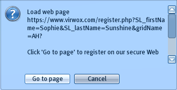
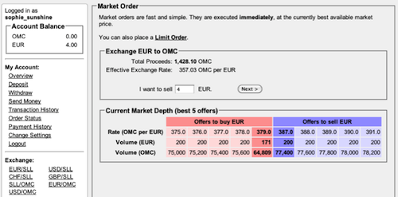
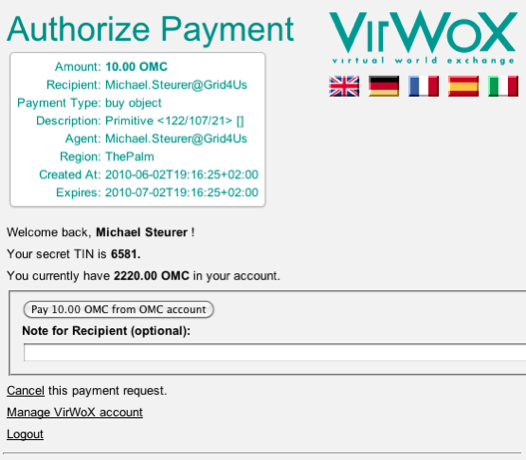
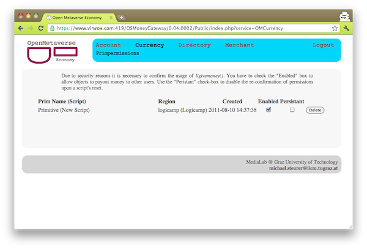
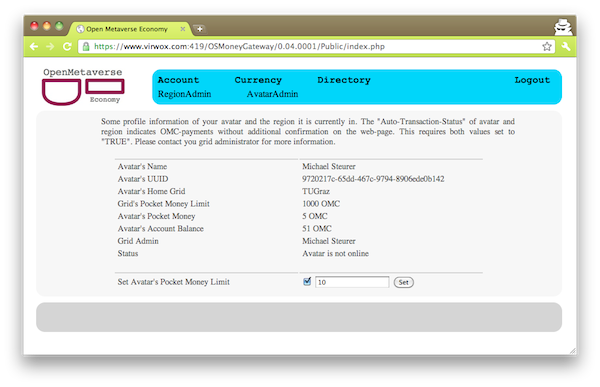

## Register Avatars with VirWoX

Before you start with the registration please verify that your home-grid supports OMC. If you are the owner of a grid you can find instructions how to OMC-enable your regions [here](/Installation).

To register, find one of the in-world registration terminals and click onto it (VirWoX provides a list of terminals for the [test](https://www.virwox.com:8000/terminals.php) system and the [productive](https://www.virwox.com/terminals.php) system).

Choose your preferred language in the blue dialog window and then select the "Yes" button to continue with the registration process.

The entire registration is done in a web browser and so you are asked to follow a link to VirWoX’s webpage. Fill in the forms correctly and finally "Register". If you have provided a valid email address you will receive a message with a temporary password to log into your VirWoX account. Due to security reasons we highly encourage you to immediately change this password.

To link your avatar with your VirWoX account go back to the in-world registration terminal and click onto it once more. If all data is correct, validate the connection.

### Get Toy Money

Log into VirWoX’ test system and select "Deposit" from the side bar. Go to the section "paysafecard" and enter the amount of money to charge the account. Enter
  0000 0000 0990 2423

as PIN code in the new form, tick the Terms-Of-Service agreement, and click the "Pay" button. Go back to the account overview and exchange the money by selecting "EUR/OMC" from the "Exchange" section in the side bar. Enter the amount of money to be exchanged and click the "Next" button.

After these steps your OMC balance should be topped up.

## Use the Currency

We support avatar to avatar transactions, avatar buys object or land, object pays avatar, and avatar pays object. Due to additional security measures all these payments require the user to log into their VirWoX accounts and confirm the actual payment to complete a transaction. Upon this confirmation the money is transferred from the actual account to the recipient's account and all further actions are executed, e.g. consignment in case of buying an object.

To actually transfer object between avatars both users need an account with VirWoX. Have a look at the instructions to create the account.

### Web Confirmation

Users can transfer by using the standard mechanisms built into the client viewer but need to confirm transactions on a webpage. In this Section we will describe the standard procedure transfer money between two avatar. This example can also be applied to buy objects or land.
Right-click onto the other avatar and select "Pay..." from the pie-chart. After choosing the amount to transfer a dialog appears in the top-right corner with a URL that directs to https://www.virwox.com/.... After logging into VirWoX' site you are provided with details of your requested transaction. To actually do the transaction you have to confirm the dialog.

If the transaction was successful both avatars are notified with a dialog box with the transaction details. In case of "Land Buy" or "Object Buy" all further actions (consignment of the bought item or change ownership of the region) are executed right after the confirmation of the payment.

### llGiveMoney

Objects can pay money to avatars using the LSL function
integer llGiveMoney(key destination, integer amount).
It requires the owner to grant DEBIT PERMISSION permission to this objects inside the client viewer (the yellow-colored dialog window) and an additional confirmation on VirWoX' webpage.

After granting the permissions inside the client viewer the user is redirected to a webpage that requests VirWoX login credentials. The logged in user is provided with a list of objects that require the additional permissions. Users have to tick the "enable" checkbox for the actual items to allow them to pay out money. If the box is unticked the objects reject to pay money to avatars. If the user denies the debit permission in the client viewer the permission is also rejected on the webpage.

Every time the user is requested for debit permissions in the client viewer, she also has to log into the webpage to confirm the permissions. Developers can stop this everytime-confirmation and check the "persistant" flag for the actual object. The set flag suppressed the extra confirmation and the object is always allowed to pay out money. Attention: Use this flag only during the development of scripts and turn it off as soon as the object pays out money to other avatars! Keep in mind that the entry in the list is not removed if you delete the object in-world.

### Pocket Money

Avatars can have certain amount of pocket money that can be transferred without the additional web confirmation. Users have to enable and set an upper limit for their avatars in the account overview.

Users can now spend money up to the specified pocket money limit without additional confirmation on VirWoX' web page. Again, users are notified with a dialog box upon a successful transfer.
If there is no more money left in the avatar's "pockets" or the transaction value exceeds the pocket-money the user is requested to confirm the transaction on the webpage. After this confirmation the pocket money is again topped up to the specified limit.

To prevent from any misuse, grid owners can have to enable or disable this feature for every region and can also specify a global pocket-money limit that can not be exceeded by user.
